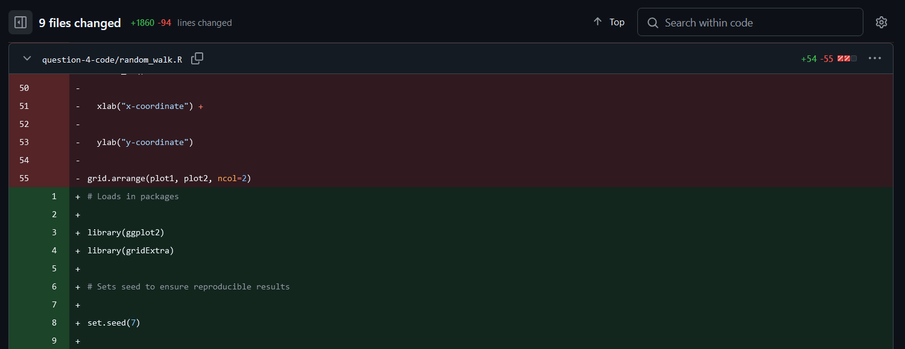

# Reproducible research: version control and R

## Instructions

The homework for this Computer skills practical is divided into 5 questions for a total of 100 points. First, fork this repo and make sure your fork is made **Public** for marking. Answers should be added to the \# INSERT ANSWERS HERE \# section above in the **README.md** file of your forked repository.

Questions 1, 2 and 3 should be answered in the **README.md** file of the `logistic_growth` repo that you forked during the practical. To answer those questions here, simply include a link to your logistic_growth repo.

**Submission**: Please submit a single **PDF** file with your candidate number (and no other identifying information), and a link to your fork of the `reproducible-research_homework` repo with the completed answers (also make sure that your username has been anonymised). All answers should be on the `main` branch.

## Assignment questions

1)  (**10 points**) Annotate the **README.md** file in your `logistic_growth` repo with more detailed information about the analysis. Add a section on the results and include the estimates for $N_0$, $r$ and $K$ (mention which \*.csv file you used).\
    \
    *My `logistic_growth` repo can be found [here](https://github.com/1ucyb/logistic_growth). Note that timestamps for some commits are incorrect; this is because I accidentally used my personal GitHub account and not my anonymised university account, which I corrected using a rebase.*\

2)  (**10 points**) Use your estimates of $N_0$ and $r$ to calculate the population size at $t$ = 4980 min, assuming that the population grows exponentially. How does it compare to the population size predicted under logistic growth?\
    \
    *See `README.md` in my `logistic_growth` repo.*\

3)  (**20 points**) Add an R script to your repository that makes a graph comparing the exponential and logistic growth curves (using the same parameter estimates you found). Upload this graph to your repo and include it in the **README.md** file so it can be viewed in the repo homepage.\
    \
    *See `README.md` in my `logistic_growth` repo.*\

4)  (**30 points**) Sometimes we are interested in modelling a process that involves randomness. A good example is Brownian motion. We will explore how to simulate a random process in a way that it is reproducible:

    a)  A script for simulating a random_walk is provided in the `question-4-code` folder of this repo. Execute the code to produce the paths of two random walks. What do you observe? (10 points)\
        \
        *The two walks are completely different, but both begin at the origin. Every time the script is rerun, the walks are randomly generated again. The walks are both plotted in 2D physical space, with time represented by a colour gradient. Each run is the same length.*\
    b)  Investigate the term **random seeds**. What is a random seed and how does it work? (5 points)\
        \
        *Normally, when random numbers are required, the generator will just pick new ones each time. However, a random seed acts as an ID for a set of results. When a seed is selected, the same random numbers will be generated in the same order every time a script is run.*\
    c)  Edit the script to make a reproducible simulation of Brownian motion. Commit the file and push it to your forked `reproducible-research_homework` repo. (10 points)\
        \
        *See `random_walk.R` in my `reproducible-research_homework` repo.*\
    d)  Go to your commit history and click on the latest commit. Show the edit you made to the code in the comparison view (add this image to the **README.md** of the fork). (5 points)\
        \
        \
        \
        *The whole script shows as edited because I made some changes to formatting while trying to work out how the script works. My inserted lines are 6-8.*\

5)  (**30 points**) In 2014, Cui, Schlub and Holmes published an article in the *Journal of Virology* (doi: <https://doi.org/10.1128/jvi.00362-14>) showing that the size of viral particles, more specifically their volume, could be predicted from their genome size (length). They found that this relationship can be modelled using an allometric equation of the form $`V = \alpha L^{\beta}`$, where $`V`$ is the virion volume in nm3 and $`L`$ is the genome length in nucleotides.

    a)  Import the data for double-stranded DNA (dsDNA) viruses taken from the Supplementary Materials of the original paper into Posit Cloud (the csv file is in the `question-5-data` folder). How many rows and columns does the table have? (3 points)\
        \
        *The table has 33 rows (not including headers) and 13 columns.*\
    b)  What transformation can you use to fit a linear model to the data? Apply the transformation. (3 points)\
        \
        *A log-log transformation is the best fit here.*\
    c)  Find the exponent ($\beta$) and scaling factor ($\alpha$) of the allometric law for dsDNA viruses and write the p-values from the model you obtained, are they statistically significant? Compare the values you found to those shown in **Table 2** of the paper, did you find the same values? (10 points)\
        \
        $\alpha$ *is 1181.8 and* $\beta$ *is 1.5152 , with p-values of 2.28e-10 and 6.44e-10 respectively. These are both very significant results, and also very close to the figures of 1182 and 1.52 given in the paper.*\
    d)  Write the code to reproduce the figure shown below. (10 points)\
        \
        *See lines 37-42 in `question_five.R`.*

e)  What is the estimated volume of a 300 kb dsDNA virus? (4 points)\
    \
    $1181.8*300^{1.5152}=6696966\text{nm}^3$
